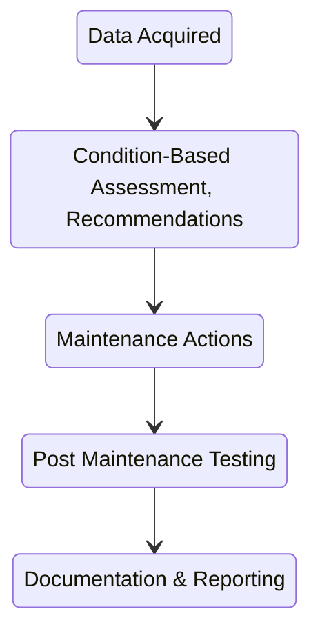

# Predictive Maintenance (PdM)
Speaker: John Itai, Sr. Supervisor Reliability & Performance Engineering

## What is Predictive Maintenance?
A **process** which requires **technologies** and **people skills** as well as combining and using all available diagnostic and performance data, mainteneance histories, operator logs, failure modes, and design data to make **timely decisions** about maintenance requirements of critical equipment.

## Why PdM?
PdM detects problems in equipment early, hopefully allowing them to be fixed before the equipment eventually fails.
-	also minimizes the cost of repair (earlier = cheaper)

-	Gain control of our maintenance work
	-	can plan and schedule the work
	-	do the correct maintenance at the right time in a cost effective manner
-	improve unit and equipment reliability
-	improve unit heat rate
-	reduce maintenance costs
-	improve safety

## Organization

## PdM Services
-	Routine data collection
-	Troubleshooting assist
-	Post-maintenance testing
-	Field balancing
-	Technology training
-	Participate on Root Cause Analysis Teams
-	Tri-Company support

## PdM Process

Data Acquired:
-	Maintenance History
-	Operator Observations
-	Design Information
-	Process Data
-	Past Failures
-	Visual Inspection
-	PdM Technologies

Documentation:
-	PlantView
-	Case History
-	Cost Benefit

Motor Analysis -> Identifies stator and rotor faults
Oil Analysis & DGA (Dissolved Gas Analysis) -> Identifies transformer and machine faults & lubrication/fluid issues